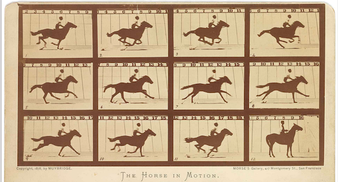

# Intro to iOS Game Development

## Minute-by-Minute

| **Elapsed** | **Time**  | **Activity**              |
| ----------- | --------- | ------------------------- |
| 0:00        | 0:05      | Objectives                |
| 0:05        | 0:15      | Overview/TT1                  |
| 0:20        | 0:30      | In Class Activity I       |
| 0:50        | 0:10      | BREAK                     |
| 0:05        | 0:20      | TT2 - Movement                |
| 1:00        | 0:45      | In Class Activity II      |
| 1:45        | 0:05      | Wrap up review objectives |
| TOTAL       | 1:50      | -                         |

## Why you should know this or industry application (optional) (5 min)

Explain why students should care to learn the material presented in this class.

## Learning Objectives (5 min)

1. Identify and describe:
- SpriteKit's role in iOS game development
- SpriteKit nodes and their chief properties
- How instances of `SKNode`, `SKSpriteNode`, and `SKScene` are used in game development
- Sprite creation and positioning
- How Frames, Frame Rate, and the Game Loop relate to each other
- The 2D Coordinate System
- Game movement: </br>
&nbsp;&nbsp;&nbsp; • with 2D Vectors </br>
&nbsp;&nbsp;&nbsp; • with simple actions (`SKAction`)
2. Implement a basic FPS game app:
- using SpriteKit
- adding nodes and simple actions

<!-- TOPICS:
SpriteKit, Sprites, Nodes (SKNode), scenes (SKScene), key node properties,
creating a sprite, Frames, Frame Rate and Game Loop

1.Implement:
- a simple FPS game? using SpriteKit, adding nodes and simple actions...

 -->


## Overview/TT I (20 min)

### Intro

#### What is SpriteKit

<!-- Briefly explain SpriteKit, show its historical antecedents: i.e., "before spritekit..." -->


<!-- SpriteKit is a 2D game engine.
Developed by Apple.
Build on top of openGL.

Let’s you create high-performance, battery-efficient 2D games. -->


 <!-- Supports/Includes:
 Textured sprites
 Physics engine (collisions, events, forces & gravity, simulations)
 Scene editor
 Particles editor (fire, smoke…)
 Camera
 Tilesets  -->


### Quick Review: Key Classes & Concepts

#### Nodes (Sprites)
Nodes are the building blocks of SpriteKit.

A __*node*__ is an object that can be put inside a scene.

Nodes in SpriteKit are commonly referred to as __*sprites.*__

`SKNode` is the base class of all nodes.

All onscreen assets will be an `SKNode` or a subclass of it.

Example subclasses of `SKNode`:
- `SKScene` &mdash; an object that organizes all of the active SpriteKit content.
- `SKShapeNode` &mdash; renders a shape defined by a Core Graphics path
- `SKVideo` &mdash; displays video content
- `SKLabel` &mdash; displays a text label

**Node Properties** </br>
SpriteKit offers many different node types, but they all share a common set of key properties inherited from `SKNode`.

A few of the most important properties of `SKNode` and its subclasses that you can manipulate:
- `position` (CGPoint)
- `xScale` (CGFloat): representing the horizontal scale of a node
- `yScale` (CGFloat): similar to xScale but it acts in the vertical direction instead
- `alpha` (CGFloat): representing the node's transparency
- `hidden` (Bool): value determining whether or not the node should be visible
- `zRotation` (CGFloat): representing the angle, in radians, that the node should be rotated
- `zPosition` (CGFloat): used to determine which nodes should be displayed on top of other nodes in the scene

*Source:* </br>
https://code.tutsplus.com/tutorials/spritekit-from-scratch-fundamentals--cms-26326


#### SKSpriteNode
The most common `SKNode` subclass that you will use is the `SKSpriteNode` class.

An `SKSpriteNode` is a type of node that can display either a colored rectangle, or an image.

#### SKScene
An instance of the `SKScene` class represents an active scene of content in SpriteKit.

A scene is the __*root node*__ in a tree of SpriteKit nodes. This tree of nodes provides content that the scene animates and renders for display.

You can display or present a scene &mdash; that is, a collection of sprites &mdash; from inside an `SKView`, `SKRenderer`, or `WKInterfaceSKScene` object.

#### Positioning
The position of a sprite is controlled by its `position` property, which is a CGPoint (a simple struct that has two properties of its own: x and y).

```Swift  
  public struct CGPoint {
    public var x: CGFloat
    public var y: CGFloat
    // ...
  }
```

By default, SpriteKit positions sprites so they are centered at `(0, 0)`, which in SpriteKit represents the bottom left.

__*Important Note*__</br>
Unlike the coordinate systems in UIKit and AppKit &mdash; where `0` on the y-axis is at the __*top-left*__ &mdash; in SpriteKit, `0` on the y-axis is at the __*bottom-left*__ of the screen:

 </br>


*Source:* </br>
https://hackernoon.com/swift-spritekit-basics-94b1798ab639


__*Simple Example:*__ </br>
Basic example of how to write code to create a sprite and set its `position` property:

```Swift  
  // create sprite
  let myCoolSprite = SKSpriteNode(color: SKColor.red,
                          size: CGSize(width: 64, height: 64))

  // set sprite's position                        
  myCoolSprite.position = CGPoint(x: 100, y: 100)
```

##### Positioning Notes

1. When you set the position of a sprite, by default you are positioning the center of the sprite (but this can be changed by setting the sprite's `anchorPoint`).

2. A sprite’s position is within the coordinate space of its parent node. The position of any node is determined relative to the position of the `anchorPoint` of its parent.

- This means that you can add sprites as children of other sprites.
- If you do this, the child sprites will move with their parents.

#### Creating A Sprite
To create a sprite and display it to your users:

1. create an instance of `SKSpriteNode`

2. configure its `size` and `position` properties

3. add it to an `SKScene` object

- Sprites are not visible unless they are inside an `SKScene` object, which means you need to add them as children of the scene itself by calling the `addChild(_:)` method (which comes with any `SKNode` object) on the `SKScene` object in which you want your sprite to appear.

<!-- For any nodes that you want in your scene, you need to add them as children of the scene itself using the `addChild(_:)` method which comes with any `SKNode` object. -->

##### Simple Example: Creating a Sprite
Example illustrates creation of a simple, colored rectangle sprite. All you need to create it is to provide the desired size and color of the rectangle and then add it as a child to the scene you want:

```Swift  

// create sprite
  let myCoolSprite = SKSpriteNode(color: SKColor.red,
                          size: CGSize(width: 64, height: 64))

  // set sprite's position                        
  myCoolSprite.position = CGPoint(x: 100, y: 100)

  // add sprite as a child of a scene
  myScene.addChild(myCoolSprite)
```

> Note: For the example above, assume that the `myScene` object is an instance of `SKScene` previously declared outside of the code snippet shown.


#### Frame Rate & the Game Loop
When we think about "real-time" game behaviors, you might imagine objects such as players (avatars), vehicles, and other things which move around the screen in what appears to be continuous motion.

What is really happening is that the screen is redrawing itself every 1/60th of a second. And every time the screen redraws, the locations on screen of some or all of the objects change slightly.

If done quickly enough, it can fool the human eye<sup>1</sup> into believing that everything is continuously moving.

> <sup>1</sup> *See "Persistence of Vision" link below...*

</br>

**Frames** </br>
Game app development borrows concepts and terminology from movie and video production, as well as from traditional and digital animation.

In an iOS game app, each individual picture drawn on screen is called a __*frame*__<sup>2</sup> &mdash; just as each individual still image in a movie, animation or video is called a frame.<sup>2</sup>

&nbsp;&nbsp;&nbsp;&nbsp;&nbsp;  </br>

</br>

>  <sup>2</sup>  *Disambiguation: The term "frame" used in game development should not to be confused with the `frame` property on UIKit objects such as the `window` and `UIView` objects.*

</br>


**Frame Rate** </br>
Games typically try to draw frames at either 30 or 60 times per second and aim to keep that rate consistent so animations appear smooth.

This rate at which the screen is redrawn is called the __*frame rate.*__ Measured in __*frames-per-second (FPS),*__ frame rate is the measure of the total number of consecutive frame redraws done in one second.

If the frame rate is low, your game is likely performing poorly for your user.

</br>

> __*Important Note:*__ Understanding frame rates in iOS game development is a critical factor in optimizing your game app's performance. This is a topic of considerable depth and complexity, of which only some small concepts might be relevant to your specific game.
>
> We recommend that you take every opportunity to become familiar with this topic.
>
> To get you started, we've provided some [Notes on Frame Rates](https://github.com/Make-School-Courses/MOB-2.2-Game-Development/blob/master/Lessons/01-Intro-iOS-Game-Development/assignments/frame_rates.md) as introductory background.

> At the very least, be aware that SpriteKit performs better on a physical device than it does in the Simulator; your frame rates will appear lower than expected when running your game in the Simulator.

</br>

**The Game Loop** </br>
Like most game engines, SpriteKit runs an endless rendering loop &mdash; often called a "game loop" &mdash; to update and render (redraw) the screen.

 </br>

*Source:* </br>
https://developer.apple.com/documentation/spritekit/skscene/responding_to_frame-cycle_events

Steps in rendering each scene typically include:
1. Updating the scene & its objects
2. Evaluate actions
3. Simulate physics
4. Apply constraints
5. Render the scene

To optimize game performance factors, including frame rate, you'll want to interact with the game loop to manage node behavior within a scene.

Example: Objects that move out of sight still consume memory, which impacts performance. The game loop offers an excellent point at which to evaluate status and remove objects no longer needed.

__*The `update(_:)` function*__ </br>
The `update(_:)` function tells your app to perform any app-specific logic to update your scene. You override it to perform per-frame game logic.

It is called exactly once per frame &mdash; *before* any actions are evaluated and any physics are simulated.

Because it is called each frame, it provides an excellent opportunity to interact with the game loop and update the positions of your nodes (sprites).

```Swift  
  override func update(_ currentTime: TimeInterval) {

          //TODO: Update nodes in this scene

      }
```

## In Class Activity I (30 min)


[Space Junk](https://github.com/Make-School-Courses/MOB-2.2-Game-Development/blob/master/Lessons/01-Intro-iOS-Game-Development/assignments/activity_1_space_junk.md)

Intro to AstroJunk...


## Movement (20 min)

### The 2D Coordinate System
In 2D graphics, we deal with space that only has two dimensions: the X and Y axes.

- X axis &mdash; Horizontal, left-to-right axis.
- Y axis &mdash; Vertical axis. Runs from bottom to top.

We call this the "2D Coordinate System":

 </br>

To describe a specific location &mdash; known as a *point* &mdash; in a 2D coordinate space, you only need to provide two numbers:

- X coordinate &mdash; the distance the location point is from the origin on the horizontal axis
- Y coordinate &mdash; how far away it is from the origin on the vertical axis

We typically write coordinates in parentheses: `(x coordinate, y coordinate)`

A point 7 units to the right of the origin and 4 units above it is written: `(7,4)`

The central point of a coordinate system used in graphics is called the *origin.*

The coordinates for the origin point itself are written `(0,0)` &mdash; which is the same as saying that it is "zero units away from the origin point on both the the x and y axes.""

### Movement with 2D Vectors

**In Mathematics and Physics** &mdash; A __*vector*__ is a geometric object that has *magnitude* (or *length*) and *direction.*

Vectors are frequently represented by a line segment with a definite direction, or graphically as an arrow, connecting an initial point `A` with a terminal point, `B`:

&nbsp;&nbsp;&nbsp;&nbsp;&nbsp;&nbsp;  </br>

&nbsp;&nbsp;&nbsp;&nbsp;&nbsp;&nbsp; *Source:* <sup>3</sup>

Vectors play an important role in physics: the velocity and acceleration of a moving object and the forces acting on that object can all be described with vectors.

**In Computer Programming** &mdash; In its most simplified definition, a __*vector*__ is a complex value (or data structure) that is composed of two or more simple values (components).

In game apps, we commonly use vectors to describe two things:
- on-screen positions (i.e., coordinates)
- velocities

Some programming languages represent 2D vectors as simple arrays. But in iOS, it is useful and very common to represent a 2D vector as a `CGPoint`. <sup>4</sup>

> <sup>4</sup> *Because the `x` and `y` coordinates behind a `CGPoint` are both of type `CGFloat`, `CGPoint` lends itself readily to calculations with other `CGFloats`. `CGPoint` is used so frequently to describe vectors in iOS that Apple created `CGVector` which, under the hood, is nearly identical to `CGPoint`. This allows you to extend `CGVector` to suit your app's particular vector-related requirements.*

**Position (or Point) Vectors** </br>
In a 2D system such as UIKit or SpriteKit, you use a coordinate point to describe the position of a view or a sprite on the x and y axes:

```Swift  
  let spritePosition = CGPoint(x: 3, y: 5)
```

An empty 2D vector — one with only zeros for each coordinate — can be written in two ways:

```Swift  
  var velocity = CGPoint(x: 0, y: 0)
```

...or...

```Swift  
  var velocity = CGPoint.zero
```

**Velocity Vectors** </br>
Vectors can also be used to store __*velocities.*__

A velocity represents how far a location changes over time.

A 2D velocity vector represents a *direction* and a *length* (aka, its *magnitude*).

For example:
- if an object is moving 4 units to the right and 6 units upward every second, you could write its velocity as `[4, 6]`.
- Then, every second, you could add the object’s velocity to its current position.


&nbsp;&nbsp;&nbsp;&nbsp;&nbsp;&nbsp;&nbsp;&nbsp;&nbsp;&nbsp;&nbsp;  </br>
&nbsp;&nbsp;&nbsp;&nbsp;&nbsp;&nbsp;&nbsp;&nbsp;&nbsp;&nbsp;&nbsp;&nbsp;&nbsp; *Graph depicting a velocity vector from point `[0, 0]` to point `[4, 6]`*

</br>

__*Direction*__ </br>
Note that in the graph above, we drew a straight line from the origin point `[0, 0]` to a second point at `[4, 6]`.

The line from the origin point to the second point gives us the __*direction*__ of the vector.

<!-- TODO: question for class: Where would the line be (i.e., what would the vector's direction be) if the vector were `[-4,6]` -->

__*Calculating Vector Length*__ </br>
For the object above with the velocity vector of `[4, 6]`, what distance will it have travelled in any given second?

To calculate the *length* (aka, *magnitude*) of a vector, you must:
- square each component of the vector,
- add up the squares of each component,
- and take the square root of the result

&nbsp;&nbsp;&nbsp;&nbsp;&nbsp;&nbsp;&nbsp;&nbsp;&nbsp;&nbsp;&nbsp;&nbsp;&nbsp; 

&nbsp;&nbsp;&nbsp;&nbsp;&nbsp;&nbsp;&nbsp;&nbsp;&nbsp;&nbsp;&nbsp;&nbsp;&nbsp; *Source:* <sup>5</sup>

```Swift
  let vector = CGPoint(x: 5, y: 7)
  let length = sqrt(vector.x * vector.x + vector.y * vector.y)

  // 8.602325267042627
 ```


__*Vector Translation*__ </br>
When you want to move an object closer to or farther away from its origin point, you add its position and velocity vectors together.

To add two vectors together &mdash; which is known as __*vector translation*__ &mdash; you simply add the respective components of each vector.

In other words:
- you sum the `x` coordinates of both vectors
- then the `y` coordinates

This results in a new position for your object.

```Swift  
  let startingPosition = CGPoint(x: 1, y: 4)
  let velocity = CGPoint(x: 2, y: 3)

  let newPosition = CGPoint(x: startingPosition.x + velocity.x,
                            y: startingPosition.y + velocity.y)

  // newPosition coordinates: [3, 7]
```


</br>

> For a good start in learning more about how to work with vectors in your game apps: </br>
> • Experiment with the code in the [Vector playground](https://github.com/Make-School-Courses/MOB-2.2-Game-Development/tree/master/Lessons/01-Intro-iOS-Game-Development/playgrounds/Vector.playground) </br>
> • Study the resources listed in Additional Resources below


<!-- TODO: discuss moving right as positive? left as negative? -->


### Movement with Actions
The above manual approach to moving a node by setting its position over time gives you power and control over movement.

But you can move, change, rotate or scale a sprite's position over time incrementally &mdash; and much more easily &mdash; using SpriteKit __*actions*__.

Usually, with only a single line of code.

SpriteKit __*actions*__ also let you easily create combinations of movements by chaining actions together.

#### SKAction
`SKAction` is a powerful class used to bring nodes to life.

Instances of `SKAction` are used to change the structure or content of a node in some way. They represent an animation that is executed by a node in the scene.

You can use `SKAction` objects to make *any* node in the scene perform an action. An action is something that changes one or more properties &mdash; like position, size, transparency, color, etc. &mdash; of *any* node in your scene &mdash; including the scene node itself. <sup>6</sup>

Actions can also change the node tree, play sounds, or even execute custom code.

Example uses:
- to change a node’s position (or other property) over time
- to change the behavior of the scene itself, such as performing a fadeout

You can also combine several actions together in:
- A sequence action
- A group action
- A repeating action

When the scene processes its nodes, the actions associated with those nodes are all processed.

##### How to Implement
To apply an action to a node, you simply need to:

1. Create an instance of `SKAction`
2. Run it by calling one of the built-in `run(_:)` functions found on the node itself, passing in the action instance just created

##### __*Creating Actions*__
To create a SpriteKit action, call one of the many built-in static constructors (factory methods)<sup>8</sup> of the `SKAction` class.

In this example, we use the `moveBy(x:y:duration:)` function built-in to `SKAction` to create an action which will make a sprite move `2` units along the x-axis and `3` units along the y axis in `1` second:

```Swift  
  let simpleTwoByThreeAction = SKAction.moveByX(2, y: 3, duration: 1)
```

Notice that this is essentially the same motion that we applied above when we created position and velocity vectors, then added them together.

But in only 1 line of code...

> <sup>8</sup> *See [Action Initializers](https://developer.apple.com/documentation/spritekit/skaction/action_initializers) for a detailed list of factory methods on `SKAction` and how to use them.*

__*Running Actions*__
Once you've created your desired action, you can run it on *any* `SKNode` object by invoking one of the node object's various `run(_:)` functions:

```Swift  
  myNode.run(simpleTwoByThreeAction)
```

And, if you want to apply the same action to multiple nodes, you can create your `SKAction` once, then call a `run(_:)` method on each of the several nodes for which you would like to perform the same action.

#### Move actions
There are several methods on `SKAction` that allow you to easily create an action that moves a node relative to its current position.

The simplest is [`move(to:duration:)`](https://developer.apple.com/documentation/spritekit/skaction/1417768-move):

```Swift  
  class func move(to location: CGPoint,
         duration: TimeInterval) -> SKAction
```

`move(to:duration:)` &mdash; Creates an action that moves a node to a new position

Example:

```Swift  
  let newPosition = CGPoint(x: 100, y: 100)
  let moveBottomLeftAction = SKAction.move(to: newPosition, duration:3.0)
  node.run(moveBottomLeftAction)
```

But there are a few variations of this basic move action worth noting:

1. `moveTo(x:duration:)` &mdash; Creates an action that moves a node horizontally.
2. `moveTo(y:duration:)` &mdash; Creates an action that moves a node vertically.

These let you specify a change in *only one* axis &mdash; either the x- or the y-position &mdash; but not both. This can save you keystrokes.

3. `moveBy(x:y:duration:)` &mdash; Creates an action that moves a node relative to its current position.

Instead of moving a node to particular point, `moveBy(x:y:duration:)` lets you move it by an offset from its current position, wherever it is at any given time. For example, the offset could be some multiple of the size of the object allowing you to move different sized objects by different amounts depending on their size.

__*Important Note:*__ </br>
This pattern of having `<action>To` and `<action>By` function variations is present in many other of the [Action Initializers](https://developer.apple.com/documentation/spritekit/skaction/action_initializers) on `SKAction`.
Feel free to use whichever variation works best and most easily for you, but remember that `<action>By` functions are preferred because the are __*reversible*__ (more on reversible actions later).


#### Sequence action

<!--

/** Creates an action that runs a collection of actions sequentially
 @param sequence An array of SKAction objects

 @discussion When the action executes, the first action in the sequence starts
 and runs to completion. Subsequent actions in the sequence run in a
 similar fashion until all of the actions in the sequence have executed.
 The duration of the sequence action is the sum of the durations of the
 actions in the sequence.

 This action is reversible; it creates a new sequence action that reverses
 the order of the actions. Each action in the reversed sequence is itself
 reversed. For example, if an action sequence is {1,2,3}, the reversed
 sequence would be {3R,2R,1R}.
 */

open class func sequence(_ actions: [SKAction]) -> SKAction -->


<!-- TODO: needs code snippets -->


<!-- TODO: needs Group Action?  -->

<!--
/** Creates an action that runs a collection of actions concurrently
 @param actions An array of SKAction objects

 @discussion When the action executes, the actions that comprise the group
 all start immediately and run in parallel. The duration of the group
 action is the longest duration among the collection of actions. If an
 action in the group has a duration less than the group’s duration, the
 action completes, then idles until the group completes the remaining
 actions. This matters most when creating a repeating action that repeats
 a group.
 */
open class func group(_ actions: [SKAction]) -> SKAction -->


<!-- Move these actions to next lesson:


#### Wait action


#### Run-block


#### Repeating actions

/** Creates an action that repeats another action a specified number of times
 @param action The action to execute
 @param count The number of times to execute the action
 */
open class func `repeat`(_ action: SKAction, count: Int) -> SKAction


/** Creates an action that repeats forever
 @param action The action to execute
 */
open class func repeatForever(_ action: SKAction) -> SKAction


## Touch events

## Playable area limitation

#### Wait-for duration action


#### Reversing actions -->


## In Class Activity II (optional) (30 min)

**Individually:**
1. Continue working on your AstroJunk app, adding movement to all nodes created so far

At end of this activity, the state of your game should be described as:
- the ship should be moving along the X axis. But when it moves, it will not stop when it hits the screen edge &mdash; it will go off screen if moved too far to the left or right
- all sprites/nodes should have their intended motions implemented
- but no collision detection will be implemented (at this point in development, when they collide, nothing will happen)

> __*If you get stuck*__ &mdash; Review key material above, especially the [Vector playground](https://github.com/Make-School-Courses/MOB-2.2-Game-Development/tree/master/Lessons/01-Intro-iOS-Game-Development/playgrounds/Vector.playground), if Understanding how to work with vectors is an obstacle to your progress.


# After Class

Assignments:
1. Review lesson 05-Introduction-to-SpriteKit from MOB 1.1 course
- be prepared to answer questions on key components outlined in Lesson 5

2. Review:

- Study the "Nodes that Draw" section in [Nodes for Scene Building - Apple docs](https://developer.apple.com/documentation/spritekit/nodes_for_scene_building)
- Game types:
  - RPG, FPS

  SKEffectNode
  SKWarpable protocol
  SKTexture

  `anchorPoint`

  `SKView`, `SKRenderer`, or `WKInterfaceSKScene`

- `SKSceneDelegate`, etc..
  https://developer.apple.com/documentation/spritekit/skscene/responding_to_frame-cycle_events


https://developer.apple.com/documentation/spritekit/skscenedelegate

Subclassing Scenes Versus Assigning a Delegate

https://developer.apple.com/documentation/spritekit/skscene/subclassing_scenes_versus_assigning_a_delegate


3. `GCVector`


3. Delta Time

4. How do you set frame rate in SpriteKit?


normalize a vector


https://developer.apple.com/documentation/spritekit/getting_started_with_actions#2982305


## Wrap Up (5 min)

- Continue working on your current tutorial
- Complete reading
- Complete challenges

## Additional Resources

1. [Slides]()
2.
https://developer.apple.com/documentation/spritekit

https://developer.apple.com/documentation/spritekit/sknode

https://developer.apple.com/documentation/spritekit/skscene/responding_to_frame-cycle_events

https://en.wikipedia.org/wiki/Key_frame


https://gameprogrammingpatterns.com/state.html


[Persistence of vision: how does animation work? - an article](https://www.futurelearn.com/courses/explore-animation/0/steps/12222) <sup>1</sup>


https://developer.apple.com/documentation/spritekit/skview/1642773-preferredframespersecond


https://developer.apple.com/library/archive/documentation/3DDrawing/Conceptual/MTLBestPracticesGuide/FrameRate.html


https://en.wikipedia.org/wiki/Coordinate_system

1. [Vector_(mathematics_and_physics) - wikipedia](https://en.wikipedia.org/wiki/Vector_(mathematics_and_physics)) [Vector_space - wikipedia](https://en.wikipedia.org/wiki/Vector_space) [Euclidean_vector - wikipedia](https://en.wikipedia.org/wiki/Euclidean_vector) <sup>3</sup>


1. [Vector Algebra - an article](https://www.mathsisfun.com/algebra/vectors.html) <sup>5</sup>


https://www.mathsisfun.com/pythagoras.html


https://www.gamedev.net/articles/programming/math-and-physics/practical-use-of-vector-math-in-games-r2968/


https://developer.apple.com/documentation/spritekit/skaction

https://developer.apple.com/documentation/spritekit/skaction/action_initializers

1. [Getting Started with Actions](https://developer.apple.com/documentation/spritekit/getting_started_with_actions#2982305 <sup>6</sup>
