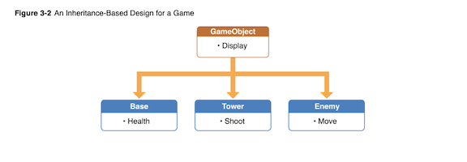
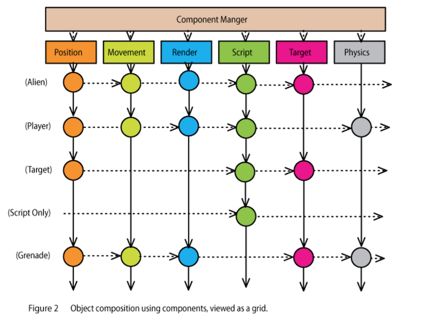

# Choosing an Architecture

<!-- INSTRUCTOR NOTES:
1) Quiz for Initial Exercise is located: -->


## Minute-by-Minute

| **Elapsed** | **Time**  | **Activity**              |
| ----------- | --------- | ------------------------- |
| 0:00        | 0:05      | Objectives                |
| 0:05        | 0:15      | Overview                  |
| 0:20        | 0:30      | In Class Activity I       |
| 0:50        | 0:10      | BREAK                     |
| 1:00        | 0:45      | In Class Activity II      |
| 1:45        | 0:05      | Wrap up review objectives |
| TOTAL       | 1:50      | -                         |

## Why you should know this or industry application (5 min)
When you develop a game app, you need to pay particular attention upfront to how your app will handle various tasks that the game needs to perform: from handling user input, to rendering graphics, to updating AI components, along with the many smaller tasks your game might need to execute.

And for every game you make, you will need to create objects to represent game elements (sometimes called "entities") such as players, vehicles and other moving objects, projectiles, and so on.

Intelligently laying out your game's structure and organizing its content in ways which facilitate adding more content and game play elements will make game development much easier.

## Learning Objectives (5 min)

1. Identify and describe the pros and cons of the most popular iOS game architectures, including:
- Inheritance-Based
- Component-Based
- State Machine
2. Identify and describe how to implement GameplayKit components
3. Refactor (implement)an existing code base into:
- Inheritance-Based architecture
- Component-Based architecture using GameplayKit
4. Implement a simple State Machine using GameplayKit


## Initial Exercise (15 min)

### As a class

In preparation for today's activities...

1. Let's review progress of the assignment from end of last class

- In your AstroJunk app, you should now have class files for your Spaceship, Meteor, and Debris elements

2. Volunteers to showcase their work on AstroJunk so far, especially their organization of class files listed above...


## Common iOS Game Architectures (20 min)
Though there are more than a few software design patterns which *could* be useful for a given game app, only a small set are commonly used for iOS game app development.

In this lesson, we will explore the high-level design concepts, benefits, and shortcomings of the patterns most commonly-used to make iOS game apps.

### Inheritance-Based Architecture
In an inheritance-based (or "hierarchy-based") architecture, each game object is a subclass of a more general base class, and all game objects ultimately derive from this initial base class.

The first step in this architecture is to define a single base class common to all game objects. (As a standard convention, the base class is often named "GameObject")

The `GameObject` base class can be designed with all the behaviors and properties common to any and all game objects, especially general tasks such as being updated every frame.

Once you have your `GameObject` class, all other game objects then inherit properties and behaviors from `GameObject`, though subclasses can also be customized to suit their own specific needs.

Note that though your `GameObject` is not required to extend either `SKNode` or `SKSpriteNode`, but doing so is a very common form of the inheritance-based layout used in iOS games.

&nbsp;&nbsp;&nbsp;&nbsp;&nbsp;&nbsp; 

#### Example
The following three classes together illustrate a simple example of using an inhertiance-based game architecture. In this example, the `Princess` and `Dragon` subclasses each inherit and override the `update(deltaTime:)` function from the base class (`GameObject`), along with whatever custom behaviors and properties the `Princess` and `Dragon` subclasses need themselves:

```Swift
class GameObject: SKSpriteNode {

    func update(deltaTime : Float) { // 'deltaTime' is the number of seconds since update() was called last

      // Override this function in subclasses to update the object state (i.e., changes in position, direction, etc.)

    }
}
```

```Swift  
class Princess: GameObject {

    var magicPowersRemaining : Int = 20 // Set initial amt of spells and magic powers
    var target : GameObject? // some other game object this object is interacting with

    override func update(deltaTime: Float) {

        super.update(deltaTime: deltaTime)

        // Do Princess-specific update tasks

    }

}
```

```Swift
class Dragon: GameObject {

    var firePowerRemaining : Int = 40 // Set initial amt of fire units
    var target : GameObject? // some other game object this object is interacting with

    override func update(deltaTime: Float) {

        super.update(deltaTime: deltaTime)

        // Do Dragon-specific update tasks

    }

}
```

It is also quite common with this pattern to create subclasses of `GameObject` for each specific type of game element in your game. For example, if your game has dragons, ogres, harpies, and cyclops, all with common traits, creating a subclass of `GameObject` of type `Monster` or `Creature` will allow you to add behaviors common to all those elements, while still inheriting all the generic behaviors from the same `GameObject` base class.

**Benefits** </br>
One key advantage of a game layout based on an inheritance hierarchy is that each object can stand on its own. In our example above, all of the behaviors of a `Princess` object live inside that single object, without needing any other object to do the work of a `Princess` element.

Inheritance-based architecture is also:
- the simplest to implement
- built on familiar concepts (object/class inheritance)

**Drawbacks** </br>
An inheritance-based layout works fine and is easy to implement for simple games.

But in practice, as your game grows in complexity, an inheritance hierarchy begins to create its own set of challenges. Examples include:
- You can often end up with a hierarchy of different game object subclass types that are multiple levels deep, which can be difficult to keep track of as you expand your code base.
- Your initial `GameObject` base class evolves as you add elements, but moving more and more code to the base class makes it long, convoluted and difficult to work with.
- Conversely, you might find that not all game elements should derive from the same generic base class &mdash; i.e., should weapons really derive from the same base class as creatures?
- Code for various game "systems" &mdash; such as a drawing function or collision detection &mdash; is all mixed together in the same object hierarchy.

<!-- inflexible -->

### Component-Based Architecture
The basic idea behind component-based architecture &mdash; otherwise known as an "Entity Component System" <sup>1</sup> &mdash; is to prefer composition over inheritance.

It seeks to eliminate the problems of deep and wide inheritance hierarchies that are difficult to understand, maintain and extend.

In a component-based architecture, *all* of your game objects (Entities) are derived from the same initial base class, but they are __*defined*__ by what __*components*__ they have &mdash; *not* by the type of subclass from which they inherit.

Each game object (Entity) has a list of components. When the game updates, or the object is added to or removed from the game &mdash; or when some other game event occurs &mdash; the object notifies each component in its component list of the event.

&nbsp;&nbsp;&nbsp;&nbsp;&nbsp;&nbsp;  </br>

&nbsp;&nbsp;&nbsp;&nbsp;&nbsp;&nbsp; *Source*: http://cowboyprogramming.com/2007/01/05/evolve-your-heirachy/

The first step in a component-based design is to create a base `Component` class:

```Swift  
class Component {

    // The game object this component is associated with
    var gameObject : GameObject?

    func update(deltaTime : Float) {
        // Update this component
    }

}
```

Next, create a base class for game objects which holds a collection of all components associated with a given object of any game element:

```Swift  
class GameObject {

    // The list of Component objects belonging to this object
    var components : [Component] = []

        func update(deltaTime : Float) { // Update this object by updating all of its components

            for component in self.components {
                component.update(deltaTime: deltaTime)
            }

        }

        // And other functions, including functions to add and remove components...
  }
```

Then, you can create specific components as customized subclasses of `Component`, subclass `GameObject` to create new Entity objects, and define each Entity object's gameplay capabilities by assigning it its own specific set of components.

<!-- TODO: useful to add examples of these last 3 steps here? -->

**Benefits** </br>
Component-based architecture is the most commonly used architecture in game app development.

In this architecture, game objects (Entities) are reduced to simple structures that serve primarily to connect various functional components, which can really boost game production.

Here are key reasons why:

1. Scalability &mdash; Whenever you need to add new features or change the way some feature works, all you need to do is to create a new component. No fussing with class hierarchies or dependencies. And new types of entities can be created on-the-fly (programmatically) without developer input.

2. Re-usability &mdash; Rather than re-using code in super-classes, you re-use code by giving similar entities similar components. Since components are self-contained, they can be interchanged to create fantastic new entities. You can also take components from one game and put them into another extremely easily.

3. Flexibility &mdash; A component-based layout means you can be more flexible with your design and not worry about inheritance issues. It also lends itself well to different kinds of games and different strategies of storing and representing entities, including data-driven entity design, or generating entities on the fly inside an editor or during gameplay.

4. Consistency &mdash; When all your game entities are instances of the same class, and all of your functionality has a standardized interface, you can avoid all of the hassle of cumbersone inheritance trees and dependency diagrams and focus on your core game functionality.


*Source:* https://www.raywenderlich.com/2806-introduction-to-component-based-architecture-in-games


**Drawbacks** </br>
The chief drawback of component-based architecture is the increase in Level Of Effort (LOE) required:

- Initially &mdash; At the start of development, you will need to create more base classes than you likely would for inheritance-based.
- As your game grows &mdash; It takes more effort to create multiple copies of an object because you need to create and add the same set of components each time you want a new copy.

> Note that Apple’s GameplayKit framework provides a set of classes that allows you to easily construct your own entity-component system. Hang tight &mdash; we'll be learning more about the GameplayKit framework shortly...


## In Class Activity I (30 min)

### Individually
So far, we've applied no special thought to the design of the game objects in you AstroJunk app. We could say that we've only applied some generic OOP concepts to it &mdash; or maybe just the very basic tenets of MVC.

**TODO:**
Your assignment is to apply what you've learned so far about inheritance-based architecture to your AstroJunk app code base by refactoring your game objects so that they now derive from an initial base class:

1. Create a `GameObject` base class
- Decide on your own what functionality, generic to all game objects, should be present in this base class
2. Create new versions of your game object classes (meteor, debris, and so on) in which each new game object class now extends from the `GameObject` class itself
3. Run your code ...

__*Result:*__ Your code should behave exactly as it did before you refactored it! The only difference should be that your game objects now derive from the `GameObject` class.

<!-- TODO: Add questions here about: 1) is it now easy to add other game objects? 2) what would be the effect if you needed to add <something complex that will cause you to have to rework your base class and all classes derived from it> ? -->


## Overview/TT II (20 min)


## In Class Activity II (optional) (30 min)

# After Class

Assignments:

1. Review:
- [Entities and Components - from Apple docs](https://developer.apple.com/library/archive/documentation/General/Conceptual/GameplayKit_Guide/EntityComponent.html)
- [The Command Pattern - MOB 2.4 Lesson 3](https://github.com/Make-School-Courses/MOB-2.4-Advanced-Architectural-Patterns-in-iOS/blob/master/Lessons/03-Behavioral-PatternsPt.1/Lesson3.md)
- [The Observer Pattern - MOB 2.4 Lesson 4](https://github.com/Make-School-Courses/MOB-2.4-Advanced-Architectural-Patterns-in-iOS/blob/master/Lessons/04-Behavioral-PatternsPt.2/Lesson4.md)
- The Strategy Pattern


<!-- TODO: find a version of this tutorial in Swift ...NOT Obj-C...

- [Introduction to Component Based Architecture in Games - A Ray Wenderlich tutorial](https://www.raywenderlich.com/2806-introduction-to-component-based-architecture-in-games)

-->


## Wrap Up (5 min)

- Continue working on your current tutorial
- Complete reading
- Complete challenges

## Additional Resources

1. [Slides]()
2. <sup>1</sup> [Entity component system - wikipedia](https://en.wikipedia.org/wiki/Entity_component_system)
3. [GameplayKit - from Apple docs](https://developer.apple.com/documentation/gameplaykit)
4. [Entity Component System - an article](http://www.roguebasin.com/index.php?title=Entity_Component_System)
5. [Refactoring Game Entities with Components - an article](http://cowboyprogramming.com/2007/01/05/evolve-your-heirachy/)
6. [Software design pattern - wikipedia](https://en.wikipedia.org/wiki/Software_design_pattern)
7. [Design Patterns: Elements of Reusable Object-Oriented Software](https://en.wikipedia.org/wiki/Design_Patterns)
- An extremely important book in the field of software development. Co-written by the "Gang of Four" (not the British punk rock group of the same name)
8. [Top 5 Design Patterns in Swift for iOS App Development - an article](https://rubygarage.org/blog/swift-design-patterns)
9. [Basic Parent-Child Concepts in Sprite Kit](http://spritekitlessons.com/child-basics-in-sprite-kit-adding-removing-finding/)


10. []()
11. []()
