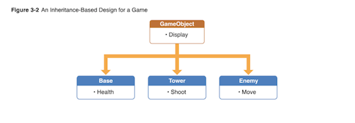

# Choosing an Architecture

<!-- INSTRUCTOR NOTES:
1) Quiz for Initial Exercise is located: -->


## Minute-by-Minute

| **Elapsed** | **Time**  | **Activity**              |
| ----------- | --------- | ------------------------- |
| 0:00        | 0:05      | Objectives                |
| 0:05        | 0:15      | Overview                  |
| 0:20        | 0:30      | In Class Activity I       |
| 0:50        | 0:10      | BREAK                     |
| 1:00        | 0:45      | In Class Activity II      |
| 1:45        | 0:05      | Wrap up review objectives |
| TOTAL       | 1:50      | -                         |

## Why you should know this or industry application (5 min)
When you develop a game app, you need to pay particular attention upfront to how your app will handle various tasks that the game needs to perform: from handling user input, to rendering graphics, to updating AI components &mdash; along with the many small tasks your game might need to handle.

And for every game you make, you will need to create objects to represent game elements (aka, "entities") such as players, vehicles and other moving objects, projectiles, and so on.

Intelligently laying out your game's structure and organizing its content in ways which facilitate adding more content and game play elements will make game development much easier.

## Learning Objectives (5 min)

1. Identify and describe
1. Define
1. Design
1. Implement

## Initial Exercise (15 min)

### As a class

In preparation for today's activities...

1. Let's review progress of the assignment from end of last class

- In your AstroJunk app, you should now have class files for your Spaceship, Meteor, and Debris elements

2. Volunteers to showcase their work on AstroJunk so far, especially their organization of class files listed above...


## Common iOS Game Architectures (20 min)
Though there are more than a few software design patterns which *could* be useful for a given game app, only a small set are commonly used for iOS game app development.

In this lesson, we will explore the high-level design concepts, benefits, and shortcomings of the patterns most commonly-used to make iOS game apps.

### Inheritance-Based Architecture
In an inheritance-based (or "hierarchy-based") architecture, each game object is a subclass of a more general base class, and all game objects ultimately derive from this initial base class.

The first step in this architecture is to define a single base class common to all game objects. (As a standard convention, the base class is often named "GameObject")

The `GameObject` base class can be designed with all the behaviors and properties common to any and all game objects, especially general tasks such as being updated every frame.

Once you have your `GameObject` class, all other game objects then inherit properties and behaviors from `GameObject`, though subclasses can also be customized to suit their own specific needs.

Note that though your `GameObject` does not need to extend either `SKNode` or `SKSpriteNode`, doing so is a very common form of the inheritance-based layout in iOS games.

&nbsp;&nbsp;&nbsp;&nbsp;&nbsp;&nbsp; 

#### Example
The following three classes together illustrate a simple example of using an inhertiance-based game architecture. In this example, the `Princess` can `Dragon` subclasses each inherit and override then `update(deltaTime:)` function from the base class (`GameObject`), along with whatever custom behaviors and properties the `Princess` can `Dragon` subclasses need:

```Swift
class GameObject: SKSpriteNode {

    func update(deltaTime : Float) { // 'deltaTime' is the number of seconds since update() was called last

      // Override this function in subclasses to update the object state (i.e., changes in position, direction, etc.)

    }
}
```

```Swift  
class Princess: GameObject {

    var magicPowersRemaining : Int = 20 // Set initial amt of spells and magic powers
    var target : GameObject? // some other game object this object is interacting with

    override func update(deltaTime: Float) {

        super.update(deltaTime: deltaTime)

        // Do Princess-specific update tasks

    }

}
```

```Swift
class Dragon: GameObject {

    var firePowerRemaining : Int = 40 // Set initial amt of fire units
    var target : GameObject? // some other game object this object is interacting with

    override func update(deltaTime: Float) {

        super.update(deltaTime: deltaTime)

        // Do Dragon-specific update tasks

    }

}
```

It is also quite common with this pattern to create subclasses of `GameObject` for each specific type of game element in your game. For example, if your game has dragons, ogres, harpies, and cyclops, all with common traits, creating a subclass of `GameObject` of type `Monster` or `Creature` will allow you to add behaviors common to all those elements, while still inheriting all the generic behaviors from the same `GameObject` base class.

**Benefits**
One key advantage of a game layout based on an inheritance hierarchy is that each object can stand on its own. In our example above, all of the behaviors of a `Princess` object live inside that single object, without needing any other object to do the work of a `Princess` element.

Inheritance-based architecture is also:
- the simplest to implement
- built on familiar concepts (object/class inheritance)

**Drawbacks**
An inheritance-based layout works fine and is easy to implement for simple games.

But in practice, as your game grows in complexity, an inheritance hierarchy begins to create its own set of challenges. Examples include:
- You can often end up with a hierarchy of different game object subclass types that are multiple levels deep, which can be difficult to keep track of as you expand your code base.
- Your initial `GameObject` base class evolves as you add elements, but moving more and more code to the base class makes it long, convoluted and difficult to work with.
- Conversely, you might find that not all game elements should derive from the same generic base class &mdash; i.e., should weapons really derive from the same base class as creatures?
- Code for various game "systems" &mdash; such as a drawing function or collision detection &mdash; is all mixed together in the same object hierarchy.

<!-- inflexible -->

### Component-Based Architecture
The basic idea behind component-based architecture &mdash; otherwise known as an "Entity Component System" <sup>1</sup> &mdash; is to prefer composition over inheritance.

It seeks to eliminate the problems of deep and wide inheritance hierarchies that are difficult to understand, maintain and extend.

In a component-based architecture, each game object has a list of components. When the game updates, or the object is added to or removed from the game &mdash; or when some other game event occurs &mdash; the object notifies each component in its component list of the event.

&nbsp;&nbsp;&nbsp;&nbsp;&nbsp;&nbsp;  </br>

&nbsp;&nbsp;&nbsp;&nbsp;&nbsp;&nbsp; *Source*: http://cowboyprogramming.com/2007/01/05/evolve-your-heirachy/

The first step is to create a base `Component` class:

```Swift  
class Component {

    // The game object this component is associated with
    var gameObject : GameObject?

    func update(deltaTime : Float) {
        // Update this component
    }

}
```

Next, create a base class for game objects which holds a collection of all components associated with a given object of any game element:

```Swift  
class GameObject {

    // The list of Component objects belonging to this object
    var components : [Component] = []

        func update(deltaTime : Float) { // Update this object by updating all of its components

            for component in self.components {
                component.update(deltaTime: deltaTime)
            }

        }

        // And other functions, including functions to add and remove components...
  }
```

<!--
**Benefits**
This is the most commonly used architecture in game apps.


Wouldnt it be better if all of the code related to shooting was in one place, and all the code for movement in another place?

These sorts of problems is exactly what component based game architecture is meant to solve! Let’s take a look.


each game object is made up of multiple components. Compare this to an inheritance-based architecture, where each game object is a subclass of some more general class


A component-based layout means you can be more flexible with your design and not worry about inheritance issues. -->
 -->


<!--
ALL of your game entities are of the same class, and they are defined by what components they have, rather than what type they inherit from. Rather than re-using code in super-classes, you re-use code by giving similar entities similar components, and rather than hiding information from your super-classes, you hide the components from one another, keeping them as self-contained as possible. -->


<!-- **Drawbacks**

The main problem with component-based architectures is that it’s more laborious to create multiple copies of an object, because you have to create and add the same set of components every time you want a new copy. -->


> *Note that Apple’s GameplayKit framework provides a set of classes for you construct your own entity-component system. Hold tight &mdash; we'll be learning more about GameplayKit framework shortly...*


<!--

Part III: Why Component-Based Architectures Rock

1. Scalability
Whenever we need to add new features, or change the way features work, all we have to do is make a new component, and the features are instantly in the game, automatically. No fussing with class hierarchies or dependencies, no hard-coded changes to the underlying engine, just new functionality. Since components are self-contained, they can be interchanged to create fantastic new entities. New types of entities can be created on the fly in our game by a procedural process, without even requiring any input from the programmer.


2. Re-usability
Games with the same component-based architecture can use each others components without any changes to the underlying engine design. As long as the interface remains consistent, you can take components from one game and put them into another extremely easily.

3. Flexibility
The Component-Based Architecture is incredibly flexible to different kinds of games and different strategies of storing and representing entities. One of the biggest perks of this architecture is that its easily applicable to data-driven entity design. You could stick all of your entities in consistent XML data files, which can be edited by designers. You could even have entities generated on the fly inside an editor or during gameplay.

4. Consistency
When all your game entities are instances of the same class, and all of your functionality has a standardized interface, it makes it much easier to keep track of what is going on in your game, and much easier to manage dependencies and capabilities. You can avoid all of the hassle of clunky inheritance trees and dependency diagrams and focus on core functionality. It can be a real production booster. In Component-Based architectures, game Entities are demoted to being linkers between various components of functionality.


https://www.raywenderlich.com/2806-introduction-to-component-based-architecture-in-games

 -->


## In Class Activity I (30 min)


## Overview/TT II (20 min)


## In Class Activity II (optional) (30 min)

# After Class

Assignments:

1. Review:
- [Entities and Components - from Apple docs](https://developer.apple.com/library/archive/documentation/General/Conceptual/GameplayKit_Guide/EntityComponent.html)


<!-- TODO: find a version of this tutorial in Swift ...NOT Obj-C...

- [Introduction to Component Based Architecture in Games - A Ray Wenderlich tutorial](https://www.raywenderlich.com/2806-introduction-to-component-based-architecture-in-games)

-->


<!-- TODO: command and Observer ...and strategy?... patterns from MOB 2.x course here  -->
<!-- TODO: insert Design Patterns links here... -->


## Wrap Up (5 min)

- Continue working on your current tutorial
- Complete reading
- Complete challenges

## Additional Resources

1. [Slides]()
2. <sup>1</sup> [Entity component system - wikipedia](https://en.wikipedia.org/wiki/Entity_component_system)
3. [GameplayKit - from Apple docs](https://developer.apple.com/documentation/gameplaykit)


1. []()
1. []()
1. []()
1. []()
