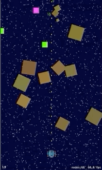

<!-- .slide: class="header" -->

# Cameras

## [Slides](https://make-school-courses.github.io/MOB-2.2-Game-Development/Slides/07-Cameras/Lesson.html ':ignore')

<!-- > -->

## Agenda

- Moving backgrounds
- Cameras
- Refactor

<!-- > -->

## Learning Objectives

- Implement cameras using SKCameraNode
- Create a moving background
- Identify different ways of creating moving backgrounds
- Practice refactoring old code

<!-- > -->

## Moving Background


<aside class="notes">
Up to now our game has a nice image as background, if you decided to take this path. The image is static and remains the same throughout the entire game.

Many games use a moving background to add a better look to the game, to give the user a sense of real movement.

In the example: as Mario moves to the right, we could think of the background moving to the left.
</aside>

<!-- > -->

## How to?

- **Moving the background**
  Make all nodes in the scene that should move, children of the background layer. Then, to scroll the game, you can simply move the background layer from right to left, and its children will move with it.

- **Moving the camera**
   Use SpriteKit’s `SKCameraNode` class. We add a camera node to the scene, and the camera node’s position represents the center of the current view.

<!-- > -->

## SKCameraNode

```swift
var cameraNode : SKCameraNode!
...
var cameraNode = SKCameraNode()
addChild(cameraNode)
camera = cameraNode
cameraNode.position = CGPoint(x: size.width/2, y: size.height/2)
```

<aside class="notes">
Creating the instance of the camera node would go in didMove.
</aside

<!-- v -->

We want the camera to move from bottom to top.

```swift
let cameraMovePointsPerSec: CGFloat = 0.6
...
func moveCamera() {
       cameraNode.position.y += cameraMovePointsPerSec
}
```

We would call this in `update`. Try running at this point.

What happens?
<!--
Everything starts moving down. And we end up with a black screen once all nodes go off screen.
-->

<!-- > -->

### Creating the background node

```swift
func backgroundNode() -> SKSpriteNode {
    // 1
    let backgroundNode = SKSpriteNode()
    backgroundNode.anchorPoint = CGPoint.zero
    backgroundNode.name = "background"
    // 2
    let background1 = SKSpriteNode(imageNamed: "background")
    background1.anchorPoint = CGPoint.zero
    background1.position = CGPoint(x: 0, y: 0)
    background1.size = UIScreen.main.bounds.size
    backgroundNode.addChild(background1)
    // 3
    let background2 = SKSpriteNode(imageNamed: "background")
    background2.anchorPoint = CGPoint.zero
    background2.position = CGPoint(x: 0, y: background1.size.height)
    background2.size = UIScreen.main.bounds.size
    backgroundNode.addChild(background2)
    // 4
    backgroundNode.size = CGSize(width: background1.size.width , height: background1.size.height + background2.size.height)
    return backgroundNode
}
```

<!-- v -->

An easy way to achieve the effect is to have the background split into different images and then as an image goes off screen, we reposition the image to the end of the image sequence.

```swift
for i in 0...1 {
  let background = backgroundNode()
  background.anchorPoint = CGPoint.zero
  background.position = CGPoint(x: 0, y: CGFloat(i)*background.size.height)
  background.name = "background"
  background.zPosition = -1
  addChild(background)
}
```

<aside class="notes">
This wraps the code in a for loop that creates two copies of the background and then sets their positions, so the second copy begins after the first ends..
</aside>

<!-- > -->

```swift
var playableRect: CGRect
var cameraRect : CGRect {
  let x = cameraNode.position.x - size.width/2 + (size.width - playableRect.width)/2
  let y = cameraNode.position.y - size.height/2 + (size.height - playableRect.height)/2
  return CGRect(x: x, y: y, width: playableRect.width, height: playableRect.height)
}
override init(size: CGSize) {
    playableRect = CGRect(x: 0, y: 0, width: size.width, height: size.height)
    super.init(size: size)
}
```

<aside class="notes">
These are helper properties that will help to calculate the visible area.
</aside>

<!-- > -->

```swift

enumerateChildNodes(withName: "background") { node, _ in
  let background = node as! SKSpriteNode
  if background.position.y + background.size.height <
    self.cameraRect.origin.y {
    background.position = CGPoint(
    x: background.position.x,
    y: background.position.y + background.size.height*2) }
}
```

<aside class="notes">
For each background node, we check if the top side of the background is less than the limit of current visible playable area (if it’s offscreen).

If it is, we move the background node to the top by double the height of the background. This will be to the top of the other background node that's visible. This code would go at the end of moveCamera()
</aside>

<!-- > -->

## Current status

Try running the game now.

What happens?

<!--
We have a moving background!
The image is not scrolling friendly
All other nodes(ship, debris and meteorites) go off screen
-->

<!-- > -->

## Fixing all nodes

```swift
ship.position.y = cameraNode.position.y - 200
```
We need the ship to be onscreen always, we can achieve that by having its position depend on the camera node.

The same principle can be applied to the rest of the elements on screen.

<!-- > -->

## Other alternatives

Particle emitters for nodes.



<aside class="notes">
Can you think about ways to achieve a parallax effect?
</aside>

<!-- > -->

## Refactoring

We've been doing a lot of our code in the GameScene. As you know this is not the preferred practice.

Refactor your code so that it becomes modular and easy to navigate.

This will be the finishing touch to our in-class game. Then you're done 😎

<!-- > -->

## After Class

- Submit the link to the project in the tracker.

This entry will determine your mid term grade. (EOW)
