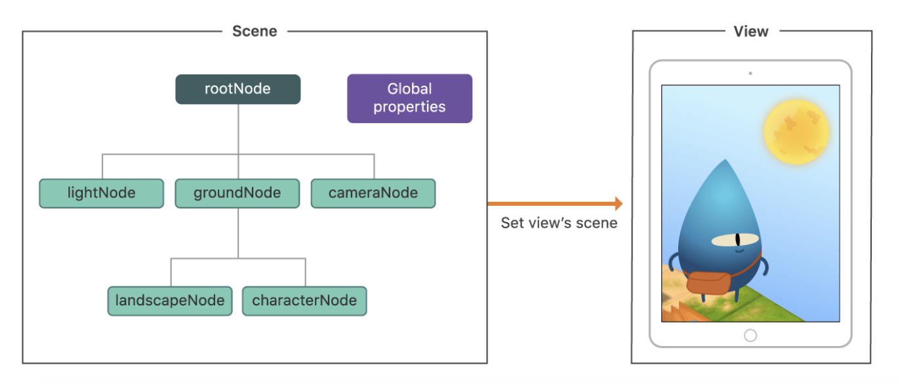
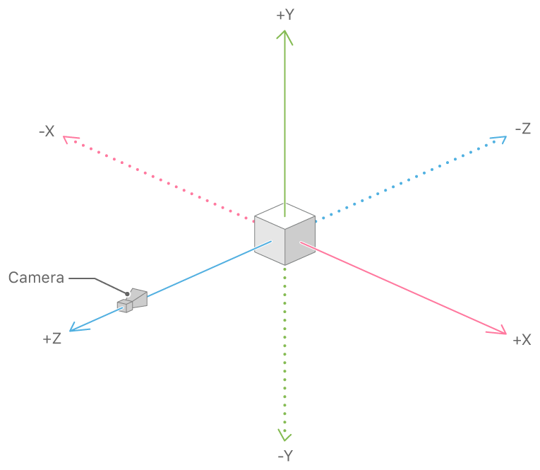
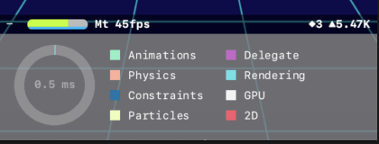

<!-- .slide: class="header" -->

# SceneKit

## [Slides](https://make-school-courses.github.io/MOB-2.2-Game-Development/Slides/08-SceneKit/Lesson.html ':ignore')

<!-- > -->

## Agenda

- SceneKit
- Main elements
- Physics
- Render Loop

<!-- > -->

## Learning Objectives

- The role of SceneKit in game development
- Create a new project with SceneKit
- Make use of the built-in functions and available geometry
- Apply physics
- Make use of materials
- Understand how the rendering loop works and use it correctly

<!-- > -->

## SceneKit

"SceneKit combines a high-performance rendering engine with a descriptive API for import, manipulation, and rendering of **3D assets**."

<!-- v -->

## Everything is a node

SceneKit implements content as a **hierarchical tree structure of nodes**, also known as a **scene graph**.

A scene consists of a root node, which defines a coordinate space for the world of the scene, and other nodes that populate the world with visible content.

<!-- v -->

These other nodes are the basic building blocks for the scene:
- 💡lights
- 🎥 cameras
- 🔺geometry
- particle emitters.

<!-- v -->



<!-- v -->

## Coordinates



<!-- v -->

**Class SCNScene**

A container for the node hierarchy and global properties that together form a displayable 3D scene.

<!-- v -->

**ClassSCNView**

A view for displaying 3D SceneKit content. This one is a subclass of UIView for iOS.

<!-- v -->

The `SCNScene` class represents a scene. We display the scene onscreen inside an instance of `SCNView`.

<!-- > -->

## Getting started

1. Create a new SceneKit project. Call it "Shapes".
1. Build & run. See what appears on screen.
1. Try dragging around.

<!-- v -->

### Exploring the example

1. What's going on in GameViewController.swift?
1. What is art.scnassets?
1. What is ship.scn?

<!-- v -->

### A little clean up

1. Remove the art.scnassets folder
2. Change the content of GameViewController to:

```swift
class GameViewController: UIViewController {
  override func viewDidLoad() {
    super.viewDidLoad()
  }
  override var shouldAutorotate: Bool {
    return true
  }
  override var prefersStatusBarHidden: Bool {
    return true
  }
}
```

<!-- v -->

3. Add a property for the view. `var scnView: SCNView!`
4. Add a method to set it up.

```swift
func setupView() {
  scnView = self.view as? SCNView
}
```

<!-- v -->

5. Do the same for the scene. `var scene: SCNScene!`

```swift
func setupScene() {
  scene = SCNScene()
  scnView.scene = scene
}
```

6. Call both setups in viewDidLoad.

<aside class="notes">
This code creates an instance of SCNScene and stores it in scene. Then sets it as the one the view will use.
</aside>

<!-- v -->

We are done setting up the clean project. Now the rest will be done by you :)

<!-- > -->

## An Exercise

Follow the instructions [here](https://github.com/Make-School-Courses/MOB-2.2-Game-Development/blob/master/Lessons/08-SceneKit/assets/instructions.md). You'll need the project we prepared before to start with an empty scene.

<!-- > -->

## Scene statistics

- **fps**: Frames per second. Measurement of the total amount of consecutive frame redraws done in one-second. The lower, the more poorly the game is performing. Should be around 60fps, to make games look and feel smooth.

- **◆**: Total draw calls per frame. The total amount of visible objects drawn per single frame. Lights affecting objects can increase this number.

- **(triangle)**: Total polygons per frame. Total amount of polygons used to draw a single frame for all the visible geometry.

- **✸**: Total visible light sources. It's recommended to not use more than 3 light sources at a time.

<!-- v -->



**Frame time**: Total amount of time it took to draw a single frame. A frame
time of 16.7ms is required to achieve a frame rate of 60fps.

**The color chart**: Frame time percentage breakdown per component.

<!-- > -->

## Challenge

Right now we have a switch statement that does the same for all the cases, no matter what the random number is.

Improve it to handle all the shapes in the enum.

You'll need to know what are the parameters needed to initialize all the geometric shapes. You can get help from SceneKit's documentation.

[Documentation to see all the shaped with their measurements](https://developer.apple.com/documentation/scenekit/scngeometry)

<!-- > -->

## Physics

We use physics bodies like in SpriteKit.

A physics body describes all the physical properties of a node: **shape, mass, friction, damping and restitution.**

The physics engine takes all this information into account when it simulates the real- world physics interactions of the objects. This includes things like gravity, friction and collisions with other bodies.

<!-- v -->

### Body types

- **Static**: Don't move, unaffected by forces.
- **Dynamic**: Moved by the physics engine in response to forces/collisions.
- **Kinematic**: Not automatically moved by the physics engine in response to forces/collisions.

<!-- v -->

### Adding a physics body

```swift
geometryNode.physicsBody = SCNPhysicsBody(type: .dynamic, shape: nil)
```

If we pass in nil for the physics shape, SceneKit will automatically generate a shape based on the visual geometry of the node.

Build and run.

<!-- v -->

### Applying forces

`applyForce(direction: at: asImpulse:)`

Pass in an instance of `SCNVector3` for both the force and the position where we want to apply that force, and whether the force should be applied as an impulse.

An **impulse** applies the force **only once** to the physics body.

Forces that aren’t impulses are applied **at each step in the physics simulation**.

SceneKit will add up all applied forces on the object and accelerate the physics body according to the net result of those forces.

<!-- v -->

```swift
let randomX = Float.random(in: -2...2)
let randomY = Float.random(in: 10...18)
let force = SCNVector3(x: randomX, y: randomY , z: 0)
let position = SCNVector3(x: 0.05, y: 0.05, z: 0.05)
geometryNode.physicsBody?.applyForce(force, at: position, asImpulse: true)
```

Build and run

<!-- v -->

## An Exercise

Follow the instructions [here](https://github.com/Make-School-Courses/MOB-2.2-Game-Development/blob/master/Lessons/08-SceneKit/assets/instructions2.md). You'll need the project have been using so far.

<!-- > -->

## After Class

1. Find out about the other force that can be applied to shapes: **Torque**. What's a good use case for it?

<!-- > -->

## Additional Resources

1. [Scenes and nodes](https://developer.apple.com/documentation/scenekit/organizing_a_scene_with_nodes)
1. [Scenekit](https://developer.apple.com/documentation/scenekit)
1. [SCNScene](https://developer.apple.com/documentation/scenekit/scnscene)
1. [Render Loop](https://developer.apple.com/documentation/scenekit/scnscenerendererdelegate)
1. [How to make a game like Stack](https://www.raywenderlich.com/670-how-to-make-a-game-like-stack)
1. 3D Apple Games by Tutorials (book)
